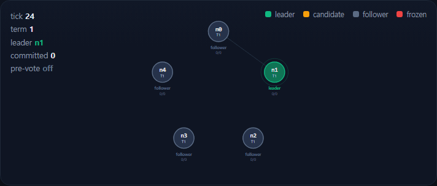
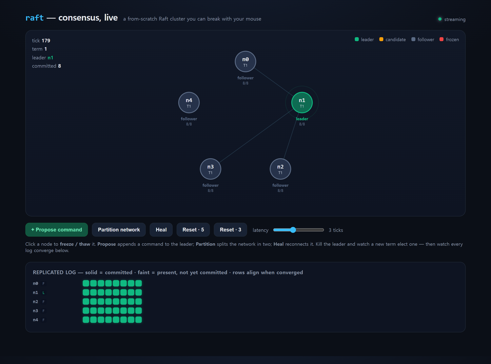
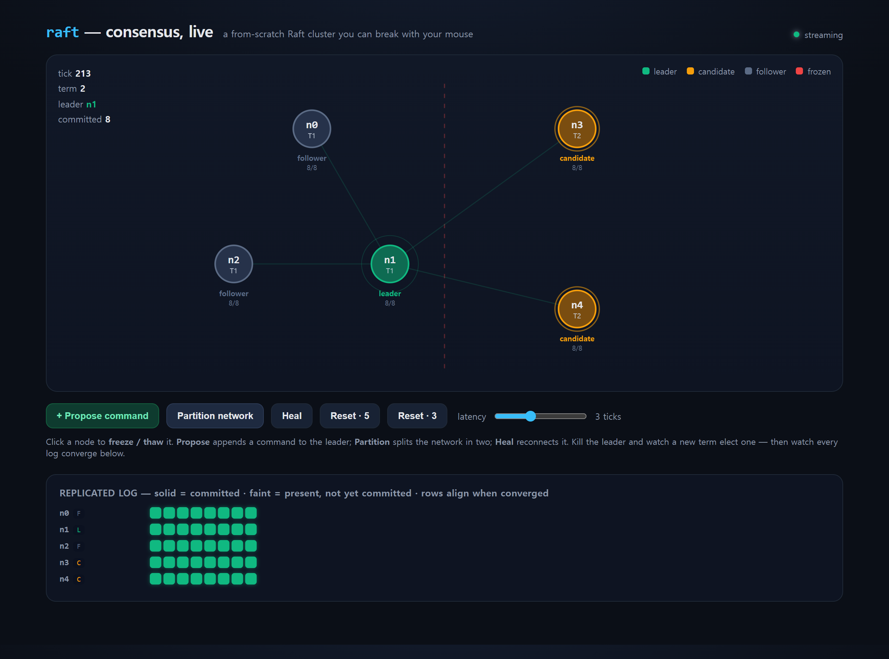
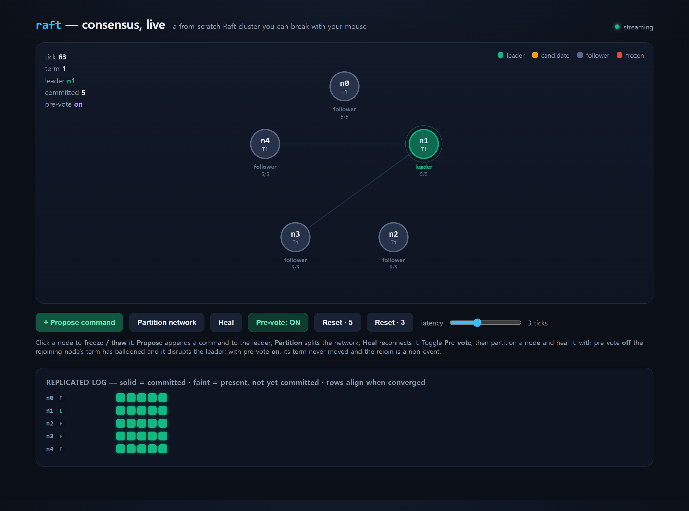
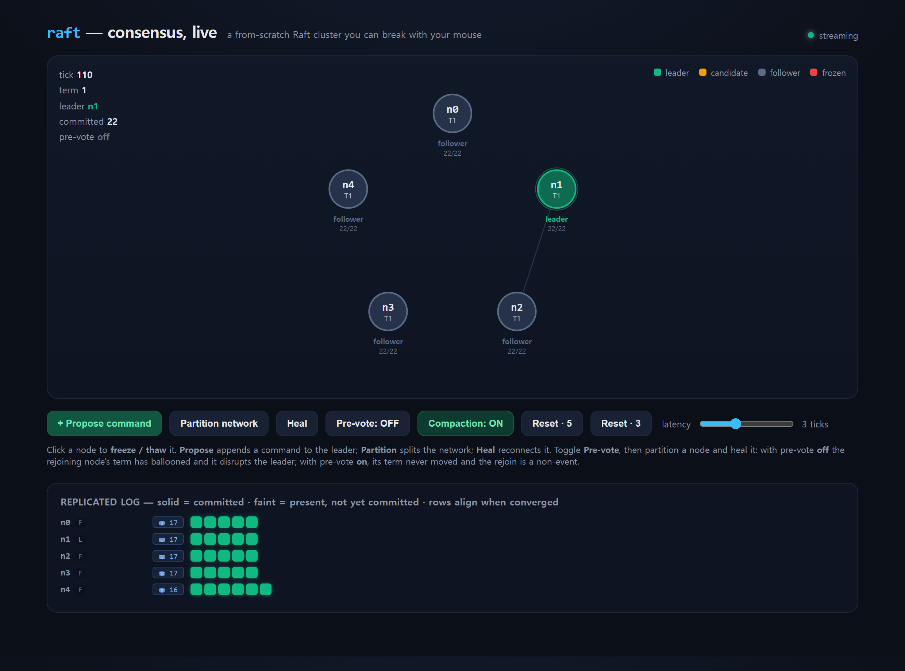
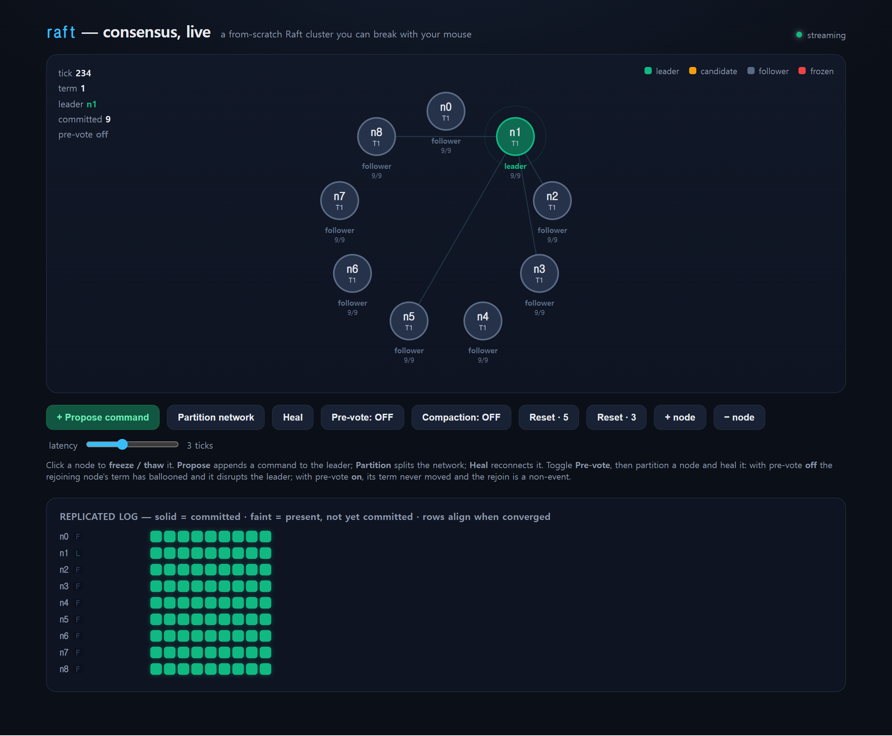
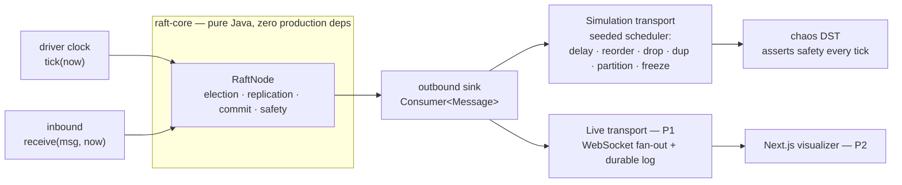

# raft

[](https://github.com/jinwovo/raft/actions/workflows/ci.yml)

A from-scratch implementation of the **Raft consensus algorithm** — leader election, log
replication, and the commit/safety rules — **proven correct under deterministic fault injection**,
and made visible through an interactive cluster visualizer you can break with your mouse.

**한국어 설명: [README.ko.md](README.ko.md)**

> Part of a distributed-systems portfolio. Its sibling **[weave](https://github.com/jinwovo/weave)**
> covers the *eventual*-consistency end of the spectrum (conflict-free replicated data types that
> converge); **raft** covers the *strong*-consistency end — a single linearizable replicated log
> agreed by a majority. `realtime-messaging` is *delivery*, `weave` is *convergence*, `raft` is
> *agreement*.

---

## Demo



*The whole loop, live: a command replicates across the cluster, the network is split (the isolated minority can only spin as candidates — no split-brain), then it heals and every log reconverges. The stills below are from the same visualizer.*



*A 5-node cluster: `n1` leads, and a proposed command has replicated and committed (solid green) on every node — all logs aligned.*



*Split the network and the majority `{n0,n1,n2}` keeps its leader, while the isolated minority `{n3,n4}` can only spin as candidates with ever-rising terms — exactly Raft's behavior under a partition. Heal it, and every log reconverges.*



*Pre-vote (§9.6) is a live toggle. With it **on**, a partitioned node never inflates its term, so rejoining the cluster doesn't force the healthy leader to step down. `PreVoteTest` proves the difference: the isolated node's term stays put with pre-vote on, but climbs past `+5` without it.*



*Log compaction (§7) is a live toggle too. Each node folds its committed prefix into a snapshot (the `⛃ 17` chip) and drops those entries, so the live log stays bounded. A follower that falls so far behind that the leader has already discarded the entries it needs is caught up in one shot by an InstallSnapshot, not entry-by-entry. `SnapshotTest` proves both.*



*Dynamic membership (§6) is live too — the configuration is itself a log entry, so adding a server (here the cluster has grown from 5 to 9) replicates like any other entry and the new node catches up. A node adopts the latest configuration in its log immediately; single-server changes are safe without joint consensus. `MembershipTest` proves an added node joins the majority and a removed one stops counting.*

---

## The problem

Strong consistency in a distributed system means every node agrees on **one** ordered log of
commands, and never disagrees — even while machines crash, the clock drifts, and the network drops,
reorders, duplicates and partitions messages. Raft (Ongaro & Ousterhout, 2014) solves this with a
single elected leader per term and a replicated log, and it pins down four safety properties that
must hold **no matter what the network does**:

| Property | Meaning |
|---|---|
| **Election Safety** | at most one leader per term |
| **Log Matching** | if two logs share an entry's (index, term), they are identical up to it |
| **Leader Completeness** | a committed entry is present in every future leader's log |
| **State Machine Safety** | no two nodes ever apply a different command at the same index |

The interesting engineering question is not "can I write the happy path?" — it is **"how do I prove
those properties survive the worst the network can do?"** This project's answer is a pure,
deterministic core plus a seeded chaos simulation.

## Design

### One core, two transports

`RaftNode` is the entire algorithm in one **single-threaded, event-driven** object that does **no
I/O, owns no threads, and never reads the wall clock**. A driver feeds it time and messages; it emits
messages into an outbound sink. That one decision is the hinge of the whole project:



Because the core can't tell the difference, the **exact same consensus code** that the visualizer
runs live is the code the simulation tortures across thousands of seeds. Even the randomness is
injected: election-timeout jitter comes from a seeded `Random`, so a run is a pure function of its
seed and any failure is perfectly reproducible.

### The algorithm (`raft-core`)

- **Leader election (§5.2, §5.4.1):** randomized election timeouts; a candidate increments the term,
  votes for itself, and wins on a majority. A vote is granted only if the candidate's log is *at
  least as up-to-date* — the rule that prevents a node missing committed entries from ever winning.
- **Log replication (§5.3):** `AppendEntries` carries `prevLogIndex/prevLogTerm`; a follower rejects
  any request that doesn't line up, and the leader backs up using a **conflict-index hint** (a whole
  term per round-trip instead of one entry at a time). Conflicting tails are truncated and overwritten;
  delayed duplicates can't erase good entries.
- **Commit & the figure-8 trap (§5.4.2):** the leader advances `commitIndex` to the highest index a
  majority has stored — but **only commits an entry from its own current term directly**, pulling
  older entries in on top of it. Dropping that guard is the classic Raft bug where a committed entry
  gets overwritten; the simulation catches it.

## Proof: a deterministic chaos simulation (DST)

Following the same Jepsen-lite / DST methodology this portfolio uses for `weave`'s CRDT convergence
(in the spirit of FoundationDB & TigerBeetle), `RaftSafetySimulationTest` drives a 3- or 5-node
cluster through an **adversarial in-memory network** — every message is delayed, reordered, dropped,
duplicated or cut off by a partition, and nodes are frozen and thawed at random — while asserting
Raft's invariants the entire time:

- **Election Safety** — checked every tick: no term ever has two leaders.
- **State Machine Safety** — committed history is a total order, so each node's applied log must stay
  a prefix of the longest; no two nodes ever apply a different command at the same index.
- **Convergence** — once the partition heals and writes stop, **every node holds the identical log
  and commit index, and exactly one leader remains** (and the run is asserted non-vacuous — real
  commands committed through the chaos).

The whole run is a pure function of the seed, so a violation collapses to a single reproducible
number.

```
RaftReplicationTest      ✓ leader election + log replication              (3)
PreVoteTest              ✓ no term inflation on a partitioned node         (3)
SnapshotTest             ✓ log compaction + InstallSnapshot catch-up       (2)
ReadIndexTest            ✓ linearizable reads; a partitioned leader can't  (4)
MembershipTest           ✓ single-server add / remove / leader self-removal (3)
LinearizabilityTest      ✓ concurrent reads+writes linearize; the checker
                           has teeth (rejects a stale-read history)        (4)
RaftSafetySimulationTest ✓ safety + convergence under chaos     (150 seeds) (1)
BUILD SUCCESSFUL — 20 tests
```

## Proof, part two: linearizability

The chaos DST proves the replicated *logs* never diverge. A separate oracle proves the values clients
actually *observe* are correct. `LinearizabilityTest` drives a live cluster with several concurrent clients
reading and writing a single register over a reordering network, records the externally observed history
(each operation's real-time call/return interval and its result), and checks it with a **Wing & Gong
linearizability checker** — the same idea as Jepsen's Knossos:

> is there *some* sequential order of these overlapping operations that both respects real time (if A
> returned before B was called, A precedes B) and obeys register semantics (every read returns the latest
> write)?

Writes go to the leader and reads go through **ReadIndex (§6.4)** — exactly the mechanism that makes a Raft
read linearizable instead of possibly-stale — and the whole concurrent history checks out as linearizable
across dozens of seeds. To show the oracle isn't vacuous, `checkerHasTeeth` feeds it a history where a read
returns a value that a fully-completed later write had already overwritten, and the checker correctly
rejects it.

## Performance

A dependency-free micro-benchmark (`./gradlew :raft-core:benchmark`) drives the **same `RaftNode`** in a
single thread over an in-memory, loss-free network and reports throughput, commit latency, and failover —
deterministic for a fixed seed:

| cluster | throughput (commits/s) | commit latency, ticks (p50 / p99 / max) | leader failover (ticks) |
|---|---:|---:|---:|
| 3 nodes | ~14,000 | 2 / 2 / 2 | ~35 |
| 5 nodes | ~5,000 | 2 / 2 / 2 | ~14 |

The numbers worth reading are the *structural* ones. **Commit latency is a flat 2 ticks** — one round trip
(leader → follower → leader) — so in a real cluster a write commits in ≈ one network RTT regardless of load.
**Failover takes a few dozen ticks**, i.e. about one election timeout, to elect a new leader and commit a
fresh write after the old leader is killed. Throughput is the in-process ceiling and only says the consensus
bookkeeping itself isn't the bottleneck — a real deployment is bound by the network, not by this code.

## Stack

- **Java 21**, Gradle (wrapper) — `raft-core` is **pure Java with zero production dependencies** on
  purpose: the safety guarantee must hold for the algorithm itself, not for any framework around it.
- **jqwik** (property/seed-driven), **JUnit 5**, **AssertJ** for the proofs.
- *P1+* Spring Boot 4.1 live server (WebSocket state stream + REST control API), Next.js visualizer.
  Deliberately **in-memory + HTTP** — no datastore — so the whole demo is `docker compose up`. See the roadmap.

## Quickstart

```bash
# one-command demo: backend + visualizer in containers, then open http://localhost:3010
docker compose up --build

# or run it locally:
./gradlew test                        # consensus specs + chaos simulation + linearizability + real-HTTP 3-node test
./gradlew :raft-core:benchmark        # throughput / commit-latency / failover numbers

# the interactive visualizer (an in-process cluster you can break with your mouse)
java -jar app/build/libs/app-*.jar    # backend on :8104 …
cd web && npm install && npm run dev   # … visualizer on http://localhost:3010

# a real cluster of three separate JVMs over HTTP — elect, replicate, kill the leader, re-elect
pwsh scripts/raft-cluster-test.ps1
```

## Roadmap

| | Milestone | Status |
|---|---|---|
| **P0** | `raft-core` engine — election, replication, commit/safety | ✅ done |
| **P0.5** | deterministic chaos simulation proving the safety invariants | ✅ done |
| **P1** | live server (Spring Boot 4.1): in-process cluster over a controllable network, WebSocket state stream, REST control API (kill / heal / partition / latency / propose) | ✅ done |
| **P2** | Next.js visualizer — node ring with role colors, leader heartbeat ping, candidate pulse, animated RPC packets, per-node replicated-log strip; click to freeze/thaw, split & heal | ✅ done |
| **P3** | **pre-vote ✅ · snapshots & log compaction ✅ · linearizable reads (ReadIndex) ✅ · dynamic membership ✅** — single-server add/remove (proven by `MembershipTest`); all four are live toggles in the visualizer | ✅ done |
| **P4** | **multi-instance over a real network ✅** — three separate JVMs talking over HTTP elect a leader, replicate to convergence, and survive a leader kill (`RealNetworkConvergenceTest` + `scripts/raft-cluster-test.ps1`) | ✅ done |
| **P5** | demo GIF · ADRs · public repo · green CI | ✅ done |
| **P6** | hardening — **linearizability oracle** (Wing & Gong / Knossos-style, with a negative test), a **throughput / latency / failover benchmark**, **leader self-removal** (§6 edge case), and a **`docker compose up` one-command demo** + a web build in CI | ✅ done |

## ADRs

- [ADR-0001 — a transport-agnostic, single-threaded consensus core](docs/adr/0001-transport-agnostic-core.md)
- [ADR-0002 — a deterministic chaos simulation (DST)](docs/adr/0002-deterministic-simulation-testing.md)
- [ADR-0003 — a wire DTO + async HTTP transport for the multi-process cluster](docs/adr/0003-real-network-transport.md)
- [ADR-0004 — proving linearizability, and a micro-benchmark, on the same core](docs/adr/0004-linearizability-and-benchmark.md)
